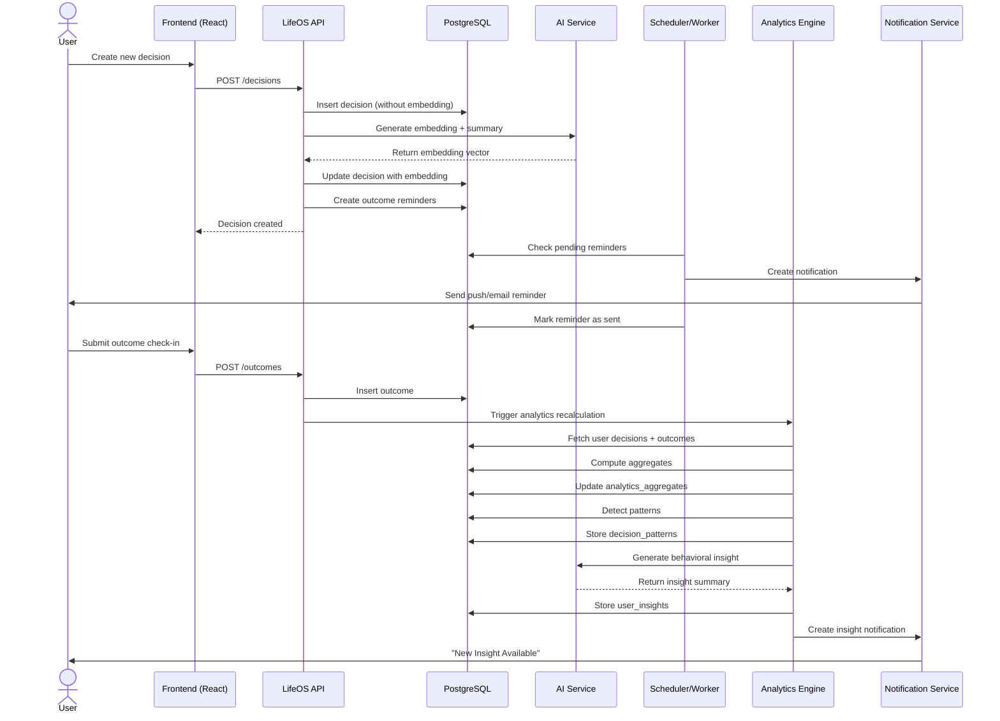
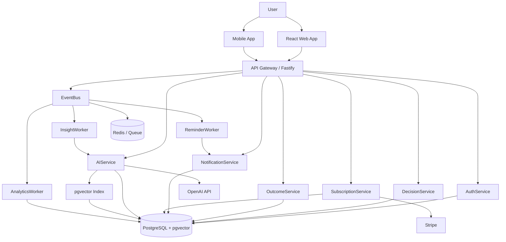

## sequence diagram end-to-end decision feature

```mermaid
sequenceDiagram

    actor User
    participant FE as Frontend (React)
    participant API as LifeOS API
    participant DB as PostgreSQL
    participant AI as AI Service
    participant Worker as Scheduler/Worker
    participant Analytics as Analytics Engine
    participant Notify as Notification Service

    %% -------------------------------
    %% CREATE DECISION
    %% -------------------------------

    User->>FE: Create new decision
    FE->>API: POST /decisions
    API->>DB: Insert decision (without embedding)
    API->>AI: Generate embedding + summary
    AI-->>API: Return embedding vector
    API->>DB: Update decision with embedding
    API->>DB: Create outcome reminders
    API-->>FE: Decision created

    %% -------------------------------
    %% REMINDER TRIGGER
    %% -------------------------------

    Worker->>DB: Check pending reminders
    Worker->>Notify: Create notification
    Notify->>User: Send push/email reminder
    Worker->>DB: Mark reminder as sent

    %% -------------------------------
    %% USER ADDS OUTCOME
    %% -------------------------------

    User->>FE: Submit outcome check-in
    FE->>API: POST /outcomes
    API->>DB: Insert outcome
    API->>Analytics: Trigger analytics recalculation

    %% -------------------------------
    %% ANALYTICS + PATTERN DETECTION
    %% -------------------------------

    Analytics->>DB: Fetch user decisions + outcomes
    Analytics->>DB: Compute aggregates
    Analytics->>DB: Update analytics_aggregates
    Analytics->>DB: Detect patterns
    Analytics->>DB: Store decision_patterns

    %% -------------------------------
    %% AI INSIGHT GENERATION
    %% -------------------------------

    Analytics->>AI: Generate behavioral insight
    AI-->>Analytics: Return insight summary
    Analytics->>DB: Store user_insights
    Analytics->>Notify: Create insight notification

    Notify->>User: "New Insight Available"
```

## Architecture Diagram

```mermaid
flowchart TB

%% -------------------------
%% CLIENT LAYER
%% -------------------------

User[User]
Web[React Web App]
Mobile[Mobile App]

User --> Web
User --> Mobile

%% -------------------------
%% API LAYER
%% -------------------------

Web --> APIGateway
Mobile --> APIGateway

APIGateway[API Gateway / Fastify]

%% -------------------------
%% CORE SERVICES
%% -------------------------

APIGateway --> AuthService
APIGateway --> DecisionService
APIGateway --> OutcomeService
APIGateway --> NotificationService
APIGateway --> SubscriptionService
APIGateway --> AIService

AuthService --> Postgres
DecisionService --> Postgres
OutcomeService --> Postgres
NotificationService --> Postgres
SubscriptionService --> Postgres
AIService --> Postgres

%% -------------------------
%% AI INTEGRATION
%% -------------------------

AIService --> OpenAI[OpenAI API]
AIService --> VectorSearch

%% -------------------------
%% VECTOR SEARCH
%% -------------------------

VectorSearch[pgvector Index]
VectorSearch --> Postgres

%% -------------------------
%% BACKGROUND WORKERS
%% -------------------------

APIGateway --> EventBus

EventBus --> AnalyticsWorker
EventBus --> ReminderWorker
EventBus --> InsightWorker

AnalyticsWorker --> Postgres
ReminderWorker --> NotificationService
InsightWorker --> AIService

%% -------------------------
%% DATA LAYER
%% -------------------------

Postgres[(PostgreSQL + pgvector)]
Redis[(Redis / Queue)]
Stripe[Stripe]

SubscriptionService --> Stripe
EventBus --> Redis
```
